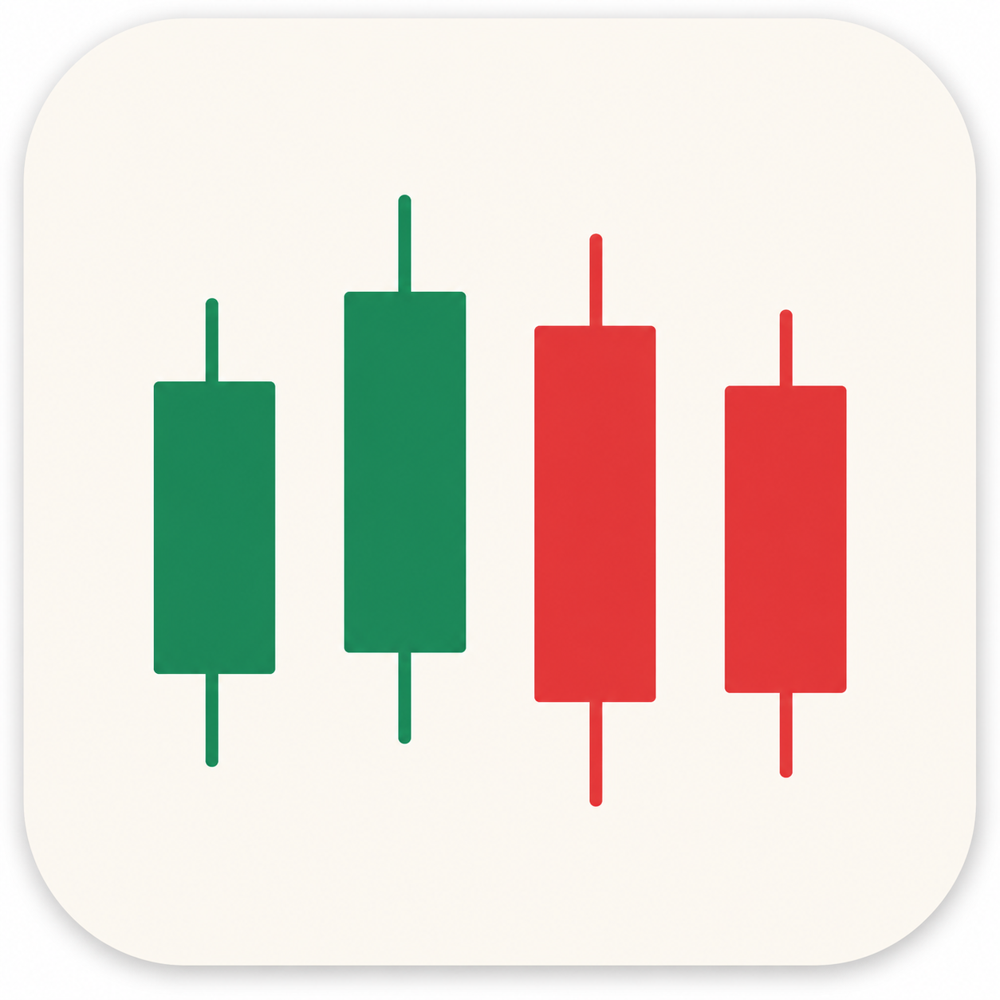

# K 线画板



手动画 K 线、画趋势线和支撑压力、加文字标注，然后截图讲解。纯静态页面，浏览器打开即可。

仓库：https://github.com/dongjiahong/drawing_k

## 打开

本地直接打开 `index.html`，或用任意静态服务：

```bash
npx serve .
```

## 部署（Nginx）

把本目录放到服务器，例如 `/var/www/drawing_k`，再引入配置：

```bash
sudo cp nginx.conf /etc/nginx/conf.d/kline.conf
# 改 nginx.conf 里的 server_name、root
sudo nginx -t && sudo nginx -s reload
```

## 用法

- **选择**（默认）：选中后拖圆点调上影、下影、开盘、收盘；拖实体可整体上下移动，左右拖可换位。空白处拖动画板，滚轮缩放。K 线拖到上下边缘时视窗会自动撑开。
- **添加**：从左往右按固定间距一根挨一根排。新 K 线默认阳线；第二根起开盘接上一根收盘。实体和影线带 5%–10% 随机波动。
- **双击切换**：双击某根 K 线，在阳/阴之间切换。
- **收盘联动**：调某根收盘价时，下一根开盘会跟着走，避免缺口。
- **直线 / 矩形 / 文字**：画完后自动回到选择。点中后可拖，Delete 删除。文字 Enter 换行，⌘Enter 结束编辑，双击再改。
- **多画板**：可切 1–4 个画板同时画几种情况。⌘C / Ctrl+C 复制当前画板，⌘V / Ctrl+V 粘贴。
- **形态**：保存当前整套布局（1–4 个画板一起）。载入时恢复画板数量和每块内容。保存在浏览器本地。
- **适应**：可见画板向中间靠拢（左板靠右、右板靠左），内侧留约 5% 空隙。标题显示为「画板一5根」，贴在各板外角。

## 文件

- `index.html`：页面结构
- `style.css`：样式
- `app.js`：画板逻辑
- `logo.png`：图标
- `nginx.conf`：Nginx 静态站点配置
